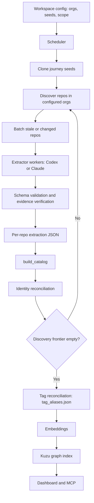

# ServiceScout Architecture

ServiceScout turns a large, multi-language codebase into a Backstage-shaped
knowledge graph that AI agents can trust — every fact carries `file:line`
evidence. The guiding principle: **deterministic static analysis owns
structural facts; the LLM owns semantic enrichment.** This document covers the
current pipeline and the direction it is evolving toward.

## Strategic goal

> Map a multi-repo enterprise topology — Components, APIs, Resources,
> Dependencies, Providers — with file:line evidence on every fact, low
> hallucination, low cost-per-repo, and broad language coverage. Surface
> the graph to AI agents over MCP so they can route, reason, and refactor
> across the organisation without manually exploring every repo.

Three things that distinguish this from existing tools:

1. **Backstage-shaped output**, not just symbol/call graphs. The agent
   should be able to answer "which service owns the `RewardSettlement`
   domain?", "which queue does `orders` publish to?", "what would break
   if Stripe went down?" — not just "who calls `validate()`?"
2. **Polyglot from day one.** No assumption that the catalog is a single
   language. Real enterprises mix Java / Kotlin / Go / Python / Node /
   C# / Ruby / Scala / Rust / PHP / Swift, often within one product.
3. **Async-aware.** First-class `producesMessage` / `consumesMessage` /
   `readsResource` / `writesResource` edges. Most code-graph tools treat
   message brokers as opaque clouds; we model them as graph endpoints.

## Pipeline architecture — current and target

### Autonomous crawl loop

The default product shape is unattended maintenance. Manual triggers exist for
operators, demos, and repair jobs, but the durable path is the scheduler running
the same crawler pipeline end to end:



Tag reconciliation runs once after catalog convergence and before embedding or
Kuzu indexing. It fingerprints the tag inventory so repeat scheduler ticks skip
the LLM call when the tags and reconciliation options have not changed.

### Current ("extractor-first")

```
┌─────────────────────────────────────────────────────────────────────┐
│ 1. LLM extract (Codex / Claude)                                     │
│    → Backstage-shaped JSON with file:line evidence on every fact    │
└───────────────────────────────┬─────────────────────────────────────┘
                                ↓
┌───────────────────────────────────────────────────────────────────┐
│ 2. Phase A — snippet substring verifier                           │
│    Pure text. For every evidence[].{path, line, snippet}:         │
│      open file, read line ±N, check snippet appears (whitespace-  │
│      normalised). Three-way verdict per fact.                     │
└───────────────────────────────┬───────────────────────────────────┘
                                ↓
┌───────────────────────────────────────────────────────────────────┐
│ 3. Phase B — tree-sitter AST cross-check                          │
│    Per-language queries (Java, Python, Go, JS, TS) on dependency  │
│    edges only. Confirms the cited line actually performs the kind │
│    of operation the edge claims (publish vs consume vs HTTP etc). │
└───────────────────────────────┬───────────────────────────────────┘
                                ↓
┌───────────────────────────────────────────────────────────────────┐
│ 4. Correction loop (stateless replay)                             │
│    If A∨B flags any fact: re-prompt the LLM with structured       │
│    feedback. LLM returns fix / drop / keep directives. Merge,     │
│    re-verify. Cap rounds at 1 (more rarely helps in practice).    │
└───────────────────────────────┬───────────────────────────────────┘
                                ↓
┌───────────────────────────────────────────────────────────────────┐
│ 5. Calibrate confidence                                           │
│    Combined A+B verdict → confidence change on dependencies and   │
│    resources (the schema's confidence-bearing categories).        │
└───────────────────────────────────────────────────────────────────┘
```

### Target ("AST-first hybrid")

Recent research and ServiceScout's own verifier results both point to
inverting this:

```
┌───────────────────────────────────────────────────────────────────┐
│ 1. Tree-sitter parse (66 languages)                               │
│    For every file: parse to AST. No LLM.                          │
└───────────────────────────────┬───────────────────────────────────┘
                                ↓
┌───────────────────────────────────────────────────────────────────┐
│ 2. AST extractors (deterministic)                                 │
│    Per-language .scm queries emit structural facts:               │
│      imports / function calls / annotations / message-broker      │
│      method calls / SQL strings / route registrations / etc.      │
│    Also: deterministic mini-extractors for Dockerfile / helm /    │
│    k8s / terraform / package.json / pom.xml.                      │
│    Output: a candidate Backstage-shaped graph with raw evidence.  │
└───────────────────────────────┬───────────────────────────────────┘
                                ↓
┌───────────────────────────────────────────────────────────────────┐
│ 3. LLM enrichment (semantic + narrative)                          │
│    Prompt the LLM with the AST-derived candidate graph and ask    │
│    only for what AST cannot give us:                              │
│      - tagline, capability_sheet, purpose                         │
│      - business domain assignment                                 │
│      - glossary terms with definitions                            │
│      - alias hygiene (canonical name vs config keys)              │
│      - confidence calibration on ambiguous edges                  │
│    No file exploration — work from the AST evidence alone.        │
└───────────────────────────────┬───────────────────────────────────┘
                                ↓
┌───────────────────────────────────────────────────────────────────┐
│ 4. Phase A+B re-verify                                            │
│    Confirm the LLM didn't smuggle in invented evidence. Phase A   │
│    on every fact; Phase B on every edge.                          │
└───────────────────────────────┬───────────────────────────────────┘
                                ↓
┌───────────────────────────────────────────────────────────────────┐
│ 5. Cross-signal reconcile                                         │
│    AST-only fact → confidence=medium. AST + LLM agree → high.     │
│    Disagreement → review (human-in-the-loop dashboard). Optional  │
│    SCIP layer when an indexer is available: bumps to verified.    │
└───────────────────────────────┬───────────────────────────────────┘
                                ↓
                Backstage-shaped knowledge graph
                served over MCP to agents
```

Why invert: deterministic AST gives **complete coverage** at **low and
predictable cost**, while LLM gives **semantic understanding**. Today
we use the LLM for structure (which it does imperfectly and expensively)
and ignore the AST signal until verification time. The right shape uses
each tool for what it's best at.

## Status

The pipeline runs end-to-end today in its extractor-first form (the steps
above). It is validated on the public sock-shop and Online Boutique benchmarks
(see [`evals/`](evals/README.md)) and has been run against a large private
workspace. The AST-first hybrid is the intended direction, not yet the default.
