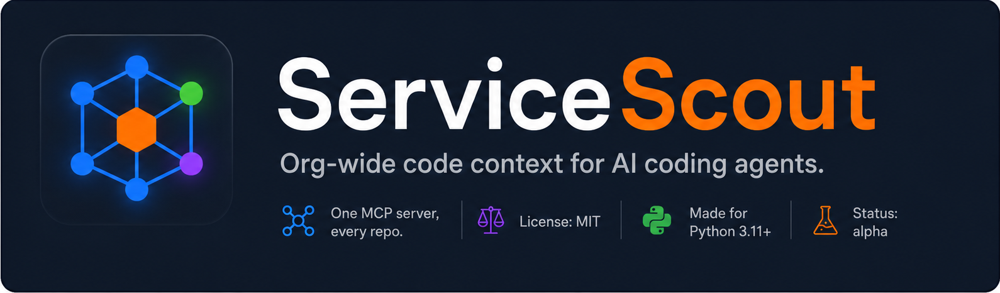
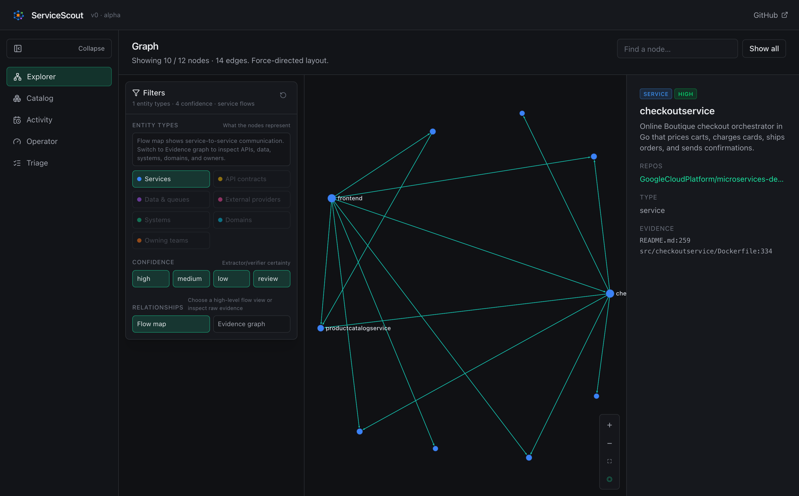
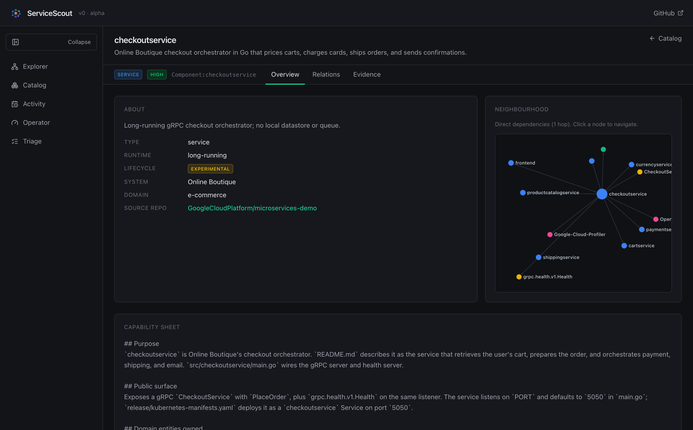
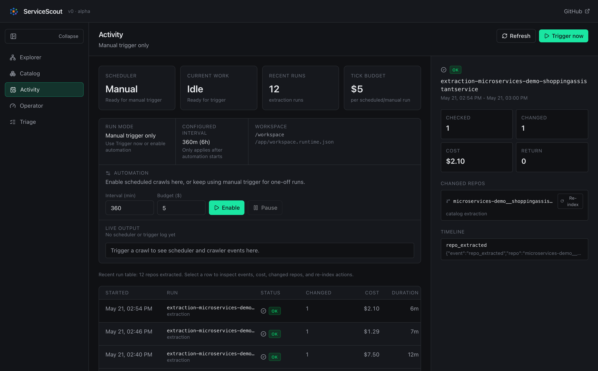

<p align="center">
  
</p>

In a multi-repo enterprise, AI coding agents struggle the moment a question
crosses one repo. They grep the open repo, guess names, or fabricate
connections. ServiceScout fixes that by giving them an evidence-backed graph
of every service, API, datastore, queue, and dependency in the org — built
automatically from source code, and served over MCP.

Ask:

> *"How does checkout work end to end?"*

Your agent calls ServiceScout, finds the storefront, BFF, backend services,
queues, databases, and owners involved, clones the right repos into context,
and answers with file:line citations from real code.

---

## Instant demo (no LLM, no credentials)

Want to see the dashboard and MCP tools right now? A small, pre-extracted
catalog of the public **Google Online Boutique** demo ships in the repo, so you
can explore without an API key or a crawl:

```bash
git clone https://github.com/lupuletic/servicescout.git
cd servicescout
make demo                              # Google Online Boutique (default)
make demo DEMO_WORKSPACE=sock-shop     # Weaveworks sock-shop
```

(First run builds the image, then serves the bundled catalog.)

Open [`http://127.0.0.1:8788`](http://127.0.0.1:8788); stop with `make demo-down`.
This indexes nothing of your own — it loads a pre-extracted catalog
([`examples/sock-shop-catalog.json`](examples/sock-shop-catalog.json) or
[`examples/online-boutique-catalog.json`](examples/online-boutique-catalog.json)).
To build a catalog from real repos, follow the Quickstart.

---

## What it looks like

A live catalog of the public Online Boutique demo (`make demo`):

**Explorer** — the service-flow graph; select any node for its tagline, source
repo, and `file:line` evidence.



**Entity view** — a service's capability sheet, dependency neighbourhood, and an
Evidence tab that ties every fact back to source.



**Activity** — extraction run history with per-run cost and duration.



---

## Quickstart

**Fastest path — point it at your own org in one command:**

```bash
git clone https://github.com/lupuletic/servicescout.git && cd servicescout
make quickstart   # interactive config on first run, then crawl + serve
```

`make quickstart` runs the setup wizard (orgs, LLM auth, budget) if you haven't
configured it yet, **pulls the prebuilt multi-arch image from Docker Hub**
(`lupuletic/servicescout` — no local build), crawls your orgs, and serves the
dashboard + MCP. The manual steps below are the same thing, broken out.

**1. Run the server (Docker, HTTP streamable on `:8765`):**

```bash
git clone https://github.com/lupuletic/servicescout.git
cd servicescout
cp .env.example .env  # fill in WORKSPACE_ROOT, GOOGLE_CLOUD_PROJECT
docker compose pull mcp dashboard  # grab the prebuilt image (or omit to build)
docker compose up -d mcp dashboard
```

Open the operator UI at [`http://127.0.0.1:8788`](http://127.0.0.1:8788).

Workspace state is selected by env vars:

- `WORKSPACE_ROOT`: mounted source checkout root.
- `SERVICESCOUT_WORKSPACE_CONFIG`: org/exclusion config used by crawler/scheduler.
- `SERVICESCOUT_DATA_DIR`: persistent catalog, Kuzu DB, run logs, and decisions.

Keeping `SERVICESCOUT_DATA_DIR` different per workspace is what prevents an
eval crawl from overwriting your real catalog.

> **First time here? Try the public eval before your own repos.** ServiceScout
> ships a pinned, isolated **sock-shop** workspace — its own source root, data
> dir, and ports — so you can exercise the dashboard and MCP tools against a
> known open-source microservices demo without ever pointing it at private
> code. See [Switch between workspaces and public evals](#switch-between-workspaces-and-public-evals)
> below. Extraction still calls your configured LLM provider (keep `BUDGET_USD`
> small), but everything it indexes is public.

**2. Crawl your own GitHub orgs to build the catalog:**

```bash
cp workspace.json.example workspace.json && $EDITOR workspace.json   # add your orgs
docker compose run --rm crawler                                       # extracts + embeds
```

The crawler is auto-convergent: it clones repos referenced by the catalog,
re-runs extraction, and stops when no new repos are discovered. Budget cap
in `.env` (`BUDGET_USD=100` by default) is a hard stop.

**3. Wire it up to your coding agent:**

```bash
./install.sh
```

Interactive — asks which agent (Claude Code / Codex / both) and the MCP
URL (default `http://127.0.0.1:8765/mcp`). Installs the `servicescout` and
`journey` skills into `~/.claude/skills/` **and** registers the MCP server
with your chosen agent(s).

Remote install is available, but inspect the script first if this is a
new machine or a shared environment:

```bash
curl -fsSL https://raw.githubusercontent.com/lupuletic/servicescout/main/install.sh | less
curl -fsSL https://raw.githubusercontent.com/lupuletic/servicescout/main/install.sh \
  | bash -s -- --agent both --url http://127.0.0.1:8765/mcp --yes
```

Or from a local checkout: `./install.sh` (same flags).

Under the hood it runs the equivalent of:

```bash
claude mcp add servicescout --scope user --transport http http://127.0.0.1:8765/mcp
codex  mcp add servicescout --url http://127.0.0.1:8765/mcp
```

Restart the agent. Ask: *"trace the login flow end-to-end"* and watch it
call `servicescout_search` → `servicescout_trace` → clone repos → answer
with citations.

## Repository layout

- `servicescout/` — Python implementation package: crawler, extraction,
  dashboard API, MCP server, storage backends, harnesses, and static extractors.
- `frontend/` — React/Sigma operator UI.
- `evals/` — reproducible benchmark workspaces and scoring harnesses.
- `docs/` — runbooks, audits, screenshots, and release-readiness notes.
- `deploy/`, `Dockerfile`, `docker-compose.yml`, `Makefile` — deployment and
  local operator entrypoints.

For local Python development (Python **3.11–3.13** — the pinned `kuzu` wheel is
not yet published for 3.14; on 3.14 use Docker or the JSON backend):

```bash
python -m pip install -e .
servicescout-dashboard --catalog data/catalog.json --host 127.0.0.1 --port 8788
```

Module entrypoints also work from a checkout, for example
`python -m servicescout.dashboard` and `python -m servicescout.crawler`.

### Remote one-box setup

For a new VM or workstation where you want the full product behind one HTTP
port, use the bundled nginx edge profile:

```bash
git clone https://github.com/lupuletic/servicescout.git
cd servicescout
cp .env.example .env
$EDITOR .env                 # set WORKSPACE_ROOT, credentials, SERVICESCOUT_HTTP_BIND
cp workspace.json.example workspace.json
$EDITOR workspace.json       # add orgs / exclusions
docker compose --profile scheduler --profile edge up -d --build
```

That starts a self-contained Compose network:

- `edge` nginx exposes `${SERVICESCOUT_HTTP_BIND:-127.0.0.1:8080}`.
- `dashboard` serves the React operator UI and API.
- `mcp` serves streamable HTTP MCP at `/mcp`.
- `scheduler` keeps the catalog fresh and writes run logs for Activity.
- `${SERVICESCOUT_DATA_DIR:-./data}` is the persistent catalog/Kuzu/run-log
  volume.

After the stack is up:

```bash
docker compose run --rm crawler
```

Then open `http://<host>:<port>/` for the UI or point agents at
`http://<host>:<port>/mcp`. Put TLS/auth in front with your normal load
balancer or reverse proxy; the bundled nginx is intentionally a small internal
edge, not an identity provider.

Extraction shells out to the Codex or Claude Code CLI inside the
crawler/scheduler container, with two auth modes:

- **Local dev** — Compose mounts your already-logged-in `~/.codex` / `~/.claude`
  into the container. Convenient on a laptop only; not a server model.
- **Headless / VM** — set an API key in `.env` and the crawler runs with no
  mounted login state. For codex set `CODEX_API_KEY` (the crawler then runs
  `codex exec --ignore-user-config`, so personal config is ignored and billing
  is explicit); for claude set `ANTHROPIC_API_KEY`. Setting `OPENAI_API_KEY`
  alone also authenticates codex but can silently switch it to API-key billing —
  prefer `CODEX_API_KEY`.

Verify the whole setup — extractor auth, GitHub access, mounts, embeddings —
before a crawl:

```bash
docker compose run --rm doctor
```

The crawler also preflights provider auth and aborts early with a clear,
actionable message if it can't authenticate, so a misconfigured run fails fast
instead of part-way through.

### Switch between workspaces and public evals

The repo includes a pinned Weaveworks sock-shop eval workspace under
`evals/workspace` and an isolated catalog under `evals/data`. You can run the
same dashboard/MCP stack against it without touching your main catalog:

```bash
make eval-setup WORKSPACE=sock-shop
make eval-extract WORKSPACE=sock-shop
python -m servicescout.build_kuzu --catalog evals/data/catalog.json --db evals/data/catalog.kuzu
docker compose --env-file .env.socks-shop.example up -d mcp dashboard
open http://127.0.0.1:8790
python evals/runner.py --workspace sock-shop
```

Watch extraction progress in the terminal: every repo prints
`==> extracting microservices-demo/<repo>` and ends with an `EXTRACTOR_RESULT`
line containing status, duration, estimated cost, and output path.

For a one-port remote-style sock-shop stack:

```bash
docker compose --env-file .env.socks-shop.example --profile edge up -d --build
open http://127.0.0.1:8081
```

The second public benchmark is Google Online Boutique / `microservices-demo`.
It is isolated under `evals/workspaces/online-boutique`:

```bash
make eval-setup WORKSPACE=online-boutique
make eval-extract WORKSPACE=online-boutique
make eval-kuzu WORKSPACE=online-boutique
make eval-run WORKSPACE=online-boutique
make eval-audit WORKSPACE=online-boutique
docker compose --env-file .env.online-boutique.example up -d mcp dashboard
open http://127.0.0.1:8792
```

For a one-port remote-style Online Boutique stack:

```bash
docker compose --env-file .env.online-boutique.example --profile edge up -d --build
open http://127.0.0.1:8082
```

To switch back to your main/private workspace, use your normal `.env` or a
copied `.env.main` based on `.env.main.example`:

```bash
docker compose --env-file .env.main up -d mcp dashboard
```

The two workspaces stay separate as long as these pairs stay separate:

| Workspace | Source root | Data root | Workspace config |
| --- | --- | --- | --- |
| Main/private | `WORKSPACE_ROOT=/Users/.../work` | `SERVICESCOUT_DATA_DIR=./data` | `SERVICESCOUT_WORKSPACE_CONFIG=./workspace.json` |
| sock-shop evals | `WORKSPACE_ROOT=./evals/workspace` | `SERVICESCOUT_DATA_DIR=./evals/data` | `SERVICESCOUT_WORKSPACE_CONFIG=./evals/workspace_orgs.json` |
| online-boutique evals | `WORKSPACE_ROOT=./evals/workspaces/online-boutique/workspace` | `SERVICESCOUT_DATA_DIR=./evals/workspaces/online-boutique/data` | `SERVICESCOUT_WORKSPACE_CONFIG=./evals/workspaces/online-boutique/workspace_orgs.json` |

The example env files also use different local ports:

- Main/private: dashboard `127.0.0.1:8788`, MCP `127.0.0.1:8765`.
- sock-shop: dashboard `127.0.0.1:8790`, MCP `127.0.0.1:8791`.
- online-boutique: dashboard `127.0.0.1:8792`, MCP `127.0.0.1:8793`.

---

## What you get

- **A Backstage-shaped catalog** of every Component, API, Resource, System,
  Domain, and Group across your orgs — built from source code, not
  hand-maintained YAML.
- **Hybrid retrieval** (BM25 IDF + dense embeddings, fused with Reciprocal
  Rank Fusion) so any natural-language prompt routes to the right repos.
- **Multi-hop journey planning** including async messaging chains
  (`producesMessage` → topic → `consumesMessage`), so your agent can trace
  flows that span 15+ services.
- **Evidence at every edge** — every relation carries `file:line` citations
  the agent can verify in source.
- **Two ready-made Claude Code skills**: `servicescout` (routing) and
  `journey` (multi-hop tracing).

---

## MCP tool surface

Eight tools. Designed so an agent uses the first one for any new task and
rarely needs the operator tool.

| Tool | Purpose |
|---|---|
| `servicescout_search(query, limit=8)` | Hybrid retrieval. Top entities + matched domain attributes / glossary. |
| `servicescout_describe(entity)` | One entity's full record + tagline + capability sheet. |
| `servicescout_neighbors(entity, direction="out"\|"in"\|"both", depth=1, edge_types=[...])` | One-step graph traversal. `direction="in"` answers "who depends on / consumes X". |
| `servicescout_trace(start, end=None, max_hops=6, include_async=True)` | Multi-hop journey planner. Returns CANDIDATE hops; agent verifies each in code. |
| `servicescout_evidence(source, target=None)` | File:line citations for an edge. |
| `servicescout_glossary(term, limit=20)` | Vocabulary lookup across component capability sheets. |
| `servicescout_owners(entity)` | Fast owner/lifecycle lookup without fetching the full entity. |
| `servicescout_status()` | Read-only catalog state. |

Write operations are intentionally **not** exposed over MCP. Operators can
trigger crawls from the dashboard Activity page; maintenance jobs still run
through Compose/CLI.

---

## Pluggable storage backends

ServiceScout's MCP server reads from a `Backend` — pick the one that fits
your environment. New backends drop into `servicescout/storage.py` behind the
same interface.

| Backend | When to use | Setup |
|---|---|---|
| **KuzuDB** *(recommended)* | Embedded graph DB with HNSW vector index + BM25 FTS. Persistent, fast at any size. | `kuzu` is pinned in `requirements.lock`; run `python -m servicescout.build_kuzu` after each crawl. |
| **JSON** | Zero-dependency fallback. Reads `data/catalog.json` into memory. Fine up to ~50k entities. | No setup — just point at `data/catalog.json`. |

Select with `--backend kuzu|json|auto` (default `auto` — Kuzu when a
database exists, JSON otherwise). The interface is the same eight tools
either way.

---

## Dashboard

A React + Sigma.js dashboard ships with the project at
[`http://localhost:8788`](http://localhost:8788) (Docker) or via
`python -m servicescout.dashboard`. Primary pages:

- **Explorer** — interactive force-directed layout of the catalog. Kind,
  edge, and confidence filters, hover-to-highlight neighbourhood,
  click-to-inspect.
- **Catalog** — searchable entity table with facets for kind, owner,
  lifecycle, runtime, environment, tag, type, and confidence.
- **Activity** — scheduler status, extraction/crawl run history, drilldown
  into each run, and trigger-now control.
- **Operator** — cost trendline, verifier signal, staleness heatmap, and
  stale repo queue.
- **Triage** — disconfirmed verifier facts, owner assignment, terminal
  decisions, external-component decisions, and decision log.

Built with **Vite + React + SWR + react-router-dom + Sigma.js
(graphology)** — no TanStack — and packaged into the same single
Docker image (`Dockerfile` runs `npm run build` automatically). The
FastAPI backend serves the built `frontend/dist/` and exposes
`/api/state.json`, `/api/entities`, `/api/entity/:ref`, `/api/graph`,
`/api/triage.json`, `/api/triage/facts`, `/api/crawl/*`, and
`/api/operator/summary`.

---

## How it works

```
  GitHub orgs ──► crawler ──► LLM extractor ──► JSON-schema validation
                                                       │
                                                       ▼
                              build_catalog ─► identity reconciliation
                                                       │
                                                       ▼
                              embed_catalog ─► dense embeddings (Gemini)
                                                       │
                                                       ▼
                              build_kuzu    ─► Kuzu index (FTS + HNSW vectors)
                                                       │
                                                       ▼
                                                  MCP server ──► AI coding agent
```

The extractor runs `codex` or `claude` CLI in non-interactive mode against
each repo, asks for a Backstage-shaped JSON document with `file:line`
evidence, and emits it through a strict JSON schema. The build step merges
per-repo extractions into a single catalog and reconciles aliases (service
names that appear as hostnames, config keys, or generated client classes).
The embed step adds Gemini embeddings to each entity. The Kuzu build step
loads the catalog into an embedded graph DB with a BM25 FTS index and an
HNSW vector index. The MCP server fuses dense + lexical retrieval (RRF,
k=60) and exposes eight tools for agents to navigate the result.

---

## Configuration

| Variable | Required | Default | Purpose |
|---|---|---|---|
| `WORKSPACE_ROOT` | yes | — | Path where the crawler clones repos. |
| `LLM_PROVIDER` | yes | `codex` | Extractor harness: `codex` or `claude`. |
| `LLM_MODEL` | yes | `gpt-5.4-mini` | Model name passed to the harness. |
| `OPENAI_API_KEY` / `ANTHROPIC_API_KEY` | provider-dependent | — | Passed through for provider tooling and future direct API harnesses. Today, still verify the selected CLI is authenticated inside the crawler container. |
| `GOOGLE_CLOUD_PROJECT` | optional | — | GCP project for Vertex AI embeddings. Empty disables embeddings (lexical-only fallback). |
| `BUDGET_USD` | optional | `100` | Hard cost cap per crawl. |
| `SERVICESCOUT_HTTP_BIND` | optional | `127.0.0.1:8080` | nginx edge bind address for remote Compose deployments. |
| `CRAWL_INTERVAL_MINUTES` | optional | `360` | Continuous scheduler interval. |
| `CRAWL_TICK_BUDGET_USD` | optional | `20` | Hard cost cap per scheduler tick. |

**Credentials it needs** (mounted read-only into the container — see
`docker-compose.yml`):

- **GitHub** — `gh` CLI auth at `~/.config/gh`, used to discover and clone
  repos. Required for crawling.
- **Extractor** — *either* an authenticated `codex` / `claude` CLI login *or*
  an API key (`CODEX_API_KEY` / `OPENAI_API_KEY` for codex, `ANTHROPIC_API_KEY`
  for claude). The crawler preflights this and exits early with a clear message
  if neither is present, so you find out before any repo is cloned.
- **Embeddings** *(optional)* — Google Cloud ADC at `~/.config/gcloud` plus
  `GOOGLE_CLOUD_PROJECT`. Leave the project empty to skip embeddings and use
  lexical-only search.

See `.env.example` for the full list. The first-run wizard
(`python -m servicescout.init_wizard`) walks you through everything interactively.
For the first controlled indexing run on a private estate, follow
[`docs/controlled-indexing-runbook.md`](docs/controlled-indexing-runbook.md).

## Security model

ServiceScout is a local-first operator tool. It is not a hosted identity
provider and it does not ship application-level auth in this alpha.

- Default Compose binds the dashboard, MCP server, and nginx edge to
  `127.0.0.1`.
- The MCP server exposes read-only catalog tools.
- The dashboard can start crawler and scheduler work. Those jobs can use the
  mounted GitHub, cloud, Codex, Claude, and LLM API credentials.
- Extraction sends source-derived prompts and snippets to the configured
  extractor provider (`codex` or `claude`). Embeddings send catalog text to the
  configured embedding provider when `GOOGLE_CLOUD_PROJECT` is set.
- Do not expose the dashboard or `/mcp` directly to the public internet. Use a
  VPN, firewall, SSH tunnel, or authenticated reverse proxy for shared access.

See [`SECURITY.md`](SECURITY.md) before connecting it to private repositories.

### Corporate TLS / package mirrors

Docker builds install Python and Node packages. In networks with TLS
inspection or package-policy blocks, add local CA PEM files under `certs/`
before building; the Dockerfile splits multi-certificate bundles and trusts
each certificate. If your network blocks public package indexes entirely,
set the usual Docker build environment or mirror variables (`PIP_INDEX_URL`,
`PIP_EXTRA_INDEX_URL`, `PIP_TRUSTED_HOST`, `NPM_CONFIG_REGISTRY`, proxy
variables) before running Compose. For fully offline or allowlisted builds,
populate `vendor/wheels/` on a network that can reach your package source:

```bash
python -m pip download -r requirements.lock -d vendor/wheels
PIP_NO_INDEX=1 docker compose build
```

Equivalent Make targets:

```bash
make wheelhouse
make docker-build-offline WORKSPACE=online-boutique
```

The runtime stack can still be started from a pre-built image with
`docker compose up -d --no-build mcp dashboard`.

---

## Status

Alpha. The pipeline works end-to-end, has public eval coverage, and has been
used against a large private workspace. Expect rough edges in the operator
path:

- `python -m servicescout.crawler --resume` can continue a compatible interrupted run by reading
  `crawler_state.json` and skipping repos already completed successfully.
  Scheduler-level incremental re-extraction is commit-aware, but long-running
  production soak and deleted-repo tombstoning are still tracked separately.
- MCP/dashboard have no built-in user auth and the dashboard can trigger
  crawls using mounted repo/LLM credentials. Keep the default localhost bind
  for SSH-tunnel use, or put the bundled nginx edge behind your normal VPN,
  firewall, SSO proxy, or load balancer before binding to a public interface.
- GitHub only — other source-control hosts are out of scope for now.

Issues and PRs welcome.

---

## Roadmap

ServiceScout is built around pluggable interfaces — `harnesses/` for
extraction, the embedding-provider hook (today: Gemini / Vertex AI), and the
storage `Backend`. Those are the intended extension points, and contributions
are welcome.

It is **GitHub-only by design**; support for other source-control hosts
(GitLab, Bitbucket, GitHub Enterprise) is not currently planned.

---

## License

MIT. See [LICENSE](LICENSE).
