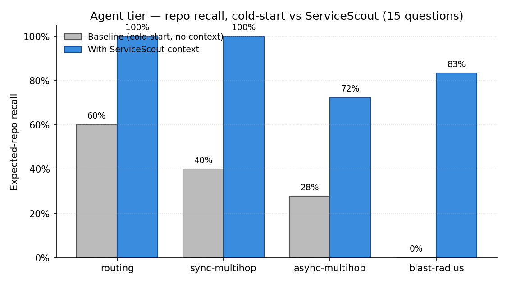
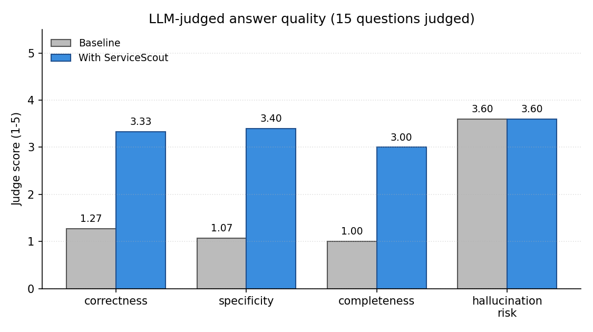
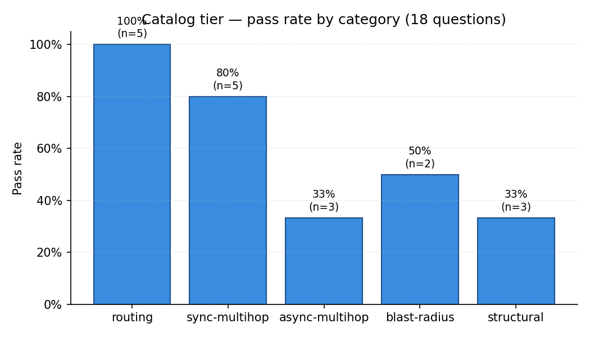
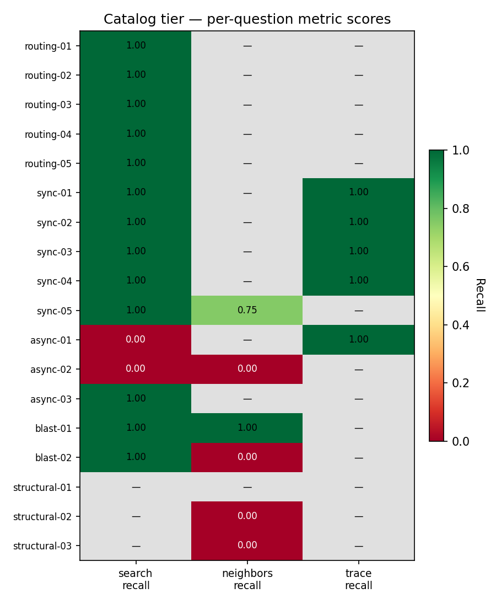
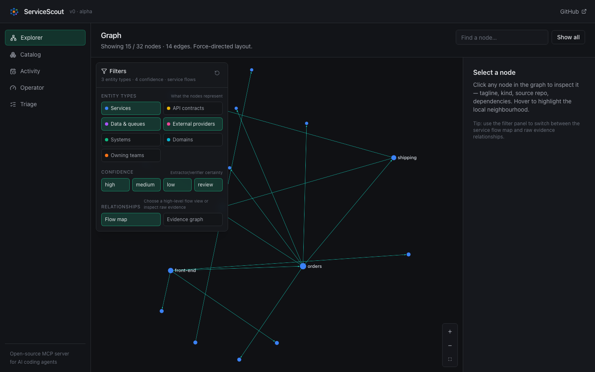
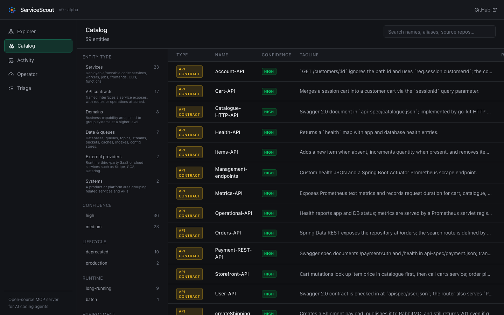
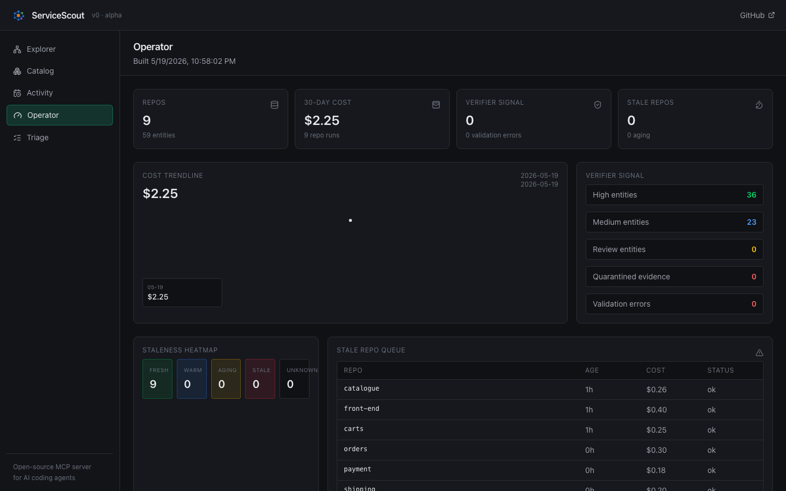

# ServiceScout evals

A small, opinionated eval harness for measuring whether ServiceScout actually
improves what AI agents (and curious humans) can learn about a multi-service
codebase they don't have on their laptop.

The default workspace is [Weaveworks sock-shop](https://microservices-demo.github.io/)
— 9 polyglot microservices with HTTP and RabbitMQ async messaging. A second
public benchmark, Google Online Boutique / `microservices-demo`, lives under
`evals/workspaces/online-boutique` and exercises focused extraction units in a
large monorepo.

## Iteration 3 — added structural-quality questions

Three new catalog-tier questions in a new `structural` category that
assert internal invariants the catalog should always satisfy. Added
after iter 2 and iter 2.1 both shipped structural bugs that no
user-facing question caught.

| Question | Asserts | Iter 3 result |
|---|---|---:|
| `structural-01` | Message brokers NOT in `providers[]` (broker is transport, not entity) | **PASS** — iter 2.1's structural win confirmed |
| `structural-02` | `Resource:shipping-task` has `consumesMessage` in-edge from `Component:shipping` | **FAIL** — shipping wrongly marked as producer |
| `structural-03` | `Resource:shipping-task` has `producesMessage` in-edge from `Component:orders` | **FAIL** — orders' publish edge missing entirely |

These add no LLM cost (catalog-only) and turn two previously-invisible
bugs into measurable signals. **Catalog tier moved from 11/15 → 12/18**:
+1 pass from the new structural-01 win, and the same 11 existing
questions still pass.

Iter 4 can now attempt to fix `shipping` direction and `orders` missing
publish with a quantitative signal that the eval suite will register
the improvement.

## Iteration 1 — baseline results

First-run benchmark with no tuning. 9 sock-shop repos, catalog built via
`codex / gpt-5.4-mini / effort=medium`, evaluated with the same model for
both the agent and the LLM judge.

| Metric | Cold-start baseline | With ServiceScout | Δ |
|---|---:|---:|---:|
| **Catalog pass rate** | — | **11/15 (73%)** | — |
| **Agent repo recall** | 38.9% | **92.2%** | **+53.3 pp** |
| **Keyword hit rate**  | 60.0% | 93.3% | +33.3 pp |
| **Judge correctness** (1-5) | 1.27 | **3.33** | **+2.07** |
| **Judge specificity** (1-5) | 1.07 | **3.40** | **+2.33** |
| **Judge completeness** (1-5) | 1.00 | **3.00** | **+2.00** |
| **Hallucination risk** (5=safe) | 3.60 | 3.60 | 0.00 |

Headline finding: the treatment becomes *specific* without becoming *wrong*
— hallucination risk doesn't move, but every other axis jumps 2+ points.






### What the 4 catalog-tier failures tell us

The four catalog-tier misses surface a real, fixable extraction issue
(not a retrieval bug) that maps cleanly to the epic backlog:

1. `async-02` / `blast-02` — questions assumed `Resource:rabbitmq`; the
   LLM extracted RabbitMQ as `Component:RabbitMQ` / `Provider:RabbitMQ`.
   Inconsistent infra-component kind classification — addressed by epic
   item #1 (AST cross-check) + extractor-prompt tightening.
2. `async-01` — async-multihop. Trace recall is 1.0 (the chain exists in
   the graph); search recall is 0.0 because the top-K is dominated by API
   entities instead of Components. Confidence-weighted RRF (epic item #6)
   + kind-priority re-balancing would lift this.
3. `sync-05` — half-recall on orders' direct dependencies. Verbose names
   (`MongoDB-orders-database`) vs hypothesised short names (`orders-db`)
   — extractor-prompt canonicalisation or alias reconciliation gap.

Each subsequent iteration's plots land in `evals/assets/` and the numbers
above get updated. Promote a new baseline with:

```bash
cp evals/runs/<latest>/*.png evals/assets/
cp evals/runs/run_<ts>.json   evals/baselines/catalog_baseline.json
```

## Three iteration speeds

You almost never want to re-extract all 9 repos. Pick the right speed for the
change you just made:

| Speed | Command | Cost | Time | When to use |
|---|---|---|---|---|
| **Re-eval only** | `python evals/runner.py --workspace sock-shop` | $0 | seconds | Prompt-only change in retrieval / scoring / RRF — extractor untouched. |
| **Targeted re-extract** | `./evals/build_eval_catalog.sh --workspace online-boutique --only frontend,checkoutservice` then re-eval | ~$0.15-$0.50 per unit | ~3-8 min per unit | Extractor prompt change that affects a known cluster. |
| **Full sweep** | `./evals/build_eval_catalog.sh --workspace sock-shop` or `--workspace online-boutique` + `runner.py --agent` | varies | 30-80 min + agent | Release-candidate validation; promote the result to baseline. |

The catalog-tier eval is genuinely free at runtime — it drives the in-memory
`Backend` over a pre-built `catalog.json` with zero LLM calls. The agent-tier
caches by `sha256(prompt)`, so cached baseline answers stay valid across
extraction changes (baseline prompts never see the catalog); only treatment
answers re-roll when the catalog changes.

**Cross-repo edge gotcha:** when targeted re-extraction touches a messaging
cluster (producers + consumers + the broker), re-extract the *whole cluster*
together. Otherwise you'll get half-complete chains in the merged catalog —
e.g. a `producesMessage` from a re-extracted publisher with no matching
`consumesMessage` from the consumer that wasn't re-extracted.

The catalog tier grades the **graph itself** — does
`servicescout_search("where is payment")` return the right component?
Does `servicescout_trace` walk the expected async chain?

The agent tier grades the **user-facing value** — given a question that a
developer (or PM) at a 200-repo org might ask, does an agent armed only
with ServiceScout outputs answer better than the same agent with no
context at all? This is the *cold-start* comparison: it intentionally
denies the baseline agent any filesystem access, because that's the real
gap in a large enterprise — most engineers don't have the right repos
cloned.

## Quickstart

```bash
# Optional: reset generated eval state for a first-run rehearsal.
# This does not touch the project-level ./data catalog.
rm -rf evals/workspace evals/data evals/runs

# 1. clone the 9 sock-shop repos at pinned SHAs
./evals/setup.sh --workspace sock-shop

# 2. build a catalog for the cloned workspace
#    (uses ServiceScout's normal extractor pipeline; costs LLM tokens once)
./evals/build_eval_catalog.sh --workspace sock-shop 2>&1 | tee /tmp/servicescout-socks-build.log

# Watch progress in the same terminal, or from another shell:
tail -f /tmp/servicescout-socks-build.log

# 3. build the local graph DB used by MCP/search
python -m servicescout.build_kuzu --catalog evals/data/catalog.json --db evals/data/catalog.kuzu

# Optional: run the operator UI/MCP against the eval catalog without touching
# ./data, because Compose is pointed at evals/data.
docker compose --env-file .env.socks-shop.example up -d mcp dashboard
open http://127.0.0.1:8790

# 4. catalog tier (free, fast — run on every change)
python evals/runner.py --workspace sock-shop

# 5. agent tier (paid; uses ANTHROPIC_API_KEY)
python evals/runner.py --workspace sock-shop --agent

# 6. render the report
python evals/report.py --runs-dir evals/runs
```

Online Boutique uses the same commands with `--workspace online-boutique`.
Its workspace config includes `repo_units[]`, so the extractor runs one focused
unit per service while still reading shared protos and root deployment manifests.

Run the README architecture check after any Online Boutique extraction to
compare the catalog against the published 11-service architecture table,
diagram flows, Redis cache expectation, allowed optional services, and source
repo link shape:

```bash
.venv/bin/python evals/validate_readme_architecture.py \
  --workspace online-boutique \
  --strict-warnings \
  --markdown-output docs/online-boutique-readme-validation.md
```

Recent verified results:

- Sock Shop: 44 entities, 76 relations, catalog eval **18/18**, audit
  `0` high findings.
- Online Boutique: 47 entities, 108 relations, catalog eval **10/10**, audit
  `0` high findings.

### Dashboard screenshots

Screenshots from the isolated sock-shop workspace are checked in under
`docs/screenshots/socks-shop-onboarding/` and can be used directly in README
examples or converted into a GIF:





## Layout

```
evals/
├── workspace.json          # the 9-repo workspace spec  (COMMITTED)
├── workspace.lock.json     # pinned SHAs written by setup.sh  (COMMITTED after first run)
├── questions.yaml          # 15 hand-curated questions w/ ground truth  (COMMITTED)
├── judge_prompt.txt        # rubric for the LLM judge  (COMMITTED)
├── setup.sh                # clones repos + pins SHAs
├── runner.py               # top-level entry
├── catalog_eval.py         # tier 1 — drives the same Backend interface MCP uses
├── agent_eval.py           # tier 2 — cold-start agent comparison + caching
├── score.py                # shared scoring helpers
├── report.py               # markdown report + baseline diff
├── workspace/              # cloned repos                    (GIT-IGNORED)
├── data/                   # eval-specific catalog snapshot  (GIT-IGNORED)
├── runs/                   # per-run results + markdown      (GIT-IGNORED)
├── cache/                  # agent response cache            (GIT-IGNORED)
└── baselines/              # promoted golden runs            (COMMITTED)
    └── catalog_baseline.json
```

## The iteration loop

The whole point is to make "did this change help?" a 5-second question.

1. Promote your current clean run as the baseline:
   ```bash
   cp evals/runs/run_<ts>.json evals/baselines/catalog_baseline.json
   git add evals/baselines/catalog_baseline.json
   git commit -m "evals: promote baseline"
   ```
2. Make a change (extractor prompt, reconcile logic, retrieval scoring, etc.).
3. Re-extract only what changed (will be cheap once item #2 of the epic ships).
4. `python evals/runner.py`
5. `python evals/report.py` — see the diff vs baseline in `runs/run_*__vs_baseline.md`.
6. If green, promote the new baseline. If regressed, investigate.

## What the metrics mean

### Catalog tier

For each question we run up to three checks:

- **search_recall** — top-K results from `backend.search()` must include any
  expected entity ref. Tests routing.
- **neighbors_recall** — the actual graph neighbours of a given entity must
  include the expected ones. Tests edge correctness (especially async).
- **trace_recall** — the multi-hop plan from `backend.trace()` must visit any
  expected intermediate node. Tests journey planning + async-chain expansion.

A question **passes** when every applicable metric is 1.0. Partial credit is
recorded in the `metrics` dict for trend tracking.

### Agent tier

For each question we run two trials with the same model:

- **baseline** — no context, no tools, no repos. Pure training-time knowledge.
  Simulates "engineer parachuted into a new org without the repos cloned."
- **treatment** — same prompt + a context blob assembled from
  `servicescout_search` + `servicescout_trace`. Simulates "agent has the
  MCP server wired in and called the obvious tools."

Each answer is scored on:

- **repo_recall** — fraction of `expected_repos` mentioned in the answer.
- **keyword_hit** — whether any `expected_keywords_any_of` token appears.
- **judge** — an LLM judge (optional, `--no-judge` to skip) returning
  `correctness`, `specificity`, `completeness`, `hallucination_risk` on a
  1-5 scale using the rubric at `judge_prompt.txt`.

Responses are cached by `(question_id, trial, model, prompt_hash)` —
re-running with no changes costs zero tokens.

## Why sock-shop specifically

- **Multi-repo by design.** Each service is its own Git repo, just like a
  real microservices org. Most demos are monorepos.
- **Async chain.** `orders → RabbitMQ → shipping + queue-master` is the
  canonical pattern ServiceScout's `producesMessage → consumesMessage`
  traversal is built for. Nothing else in the public OSS demos has it
  this clearly.
- **Polyglot.** Go + Java/Spring + Node.js + Python. Tests that
  extraction and confidence calibration aren't language-specific.
- **Frozen.** The repos haven't materially evolved in years. Ground truth
  is stable; SHA pinning keeps it that way.

## Limits this scaffold accepts

- The agent tier currently uses **direct Anthropic API calls** with a
  pre-computed context blob, not real MCP-tool invocation by a subprocess
  agent. This is intentionally simpler — it tests the *value of the
  context* rather than the *quality of tool invocation by the agent*.
  Swapping in `claude --print` (with the MCP server registered) is the
  natural next step once it's worth the extra harness complexity.
- The judge is a single Claude call with a temperature-default rubric.
  Drift across model versions is real. Pin a judge model in CI and
  treat the rubric as code.
- 15 questions is a small N. Treat absolute numbers as illustrative;
  trust *deltas* over absolute scores.
